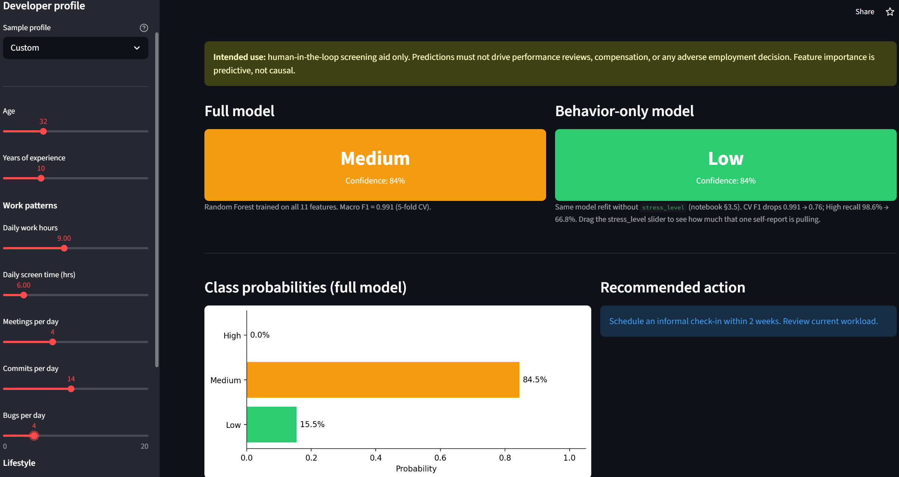
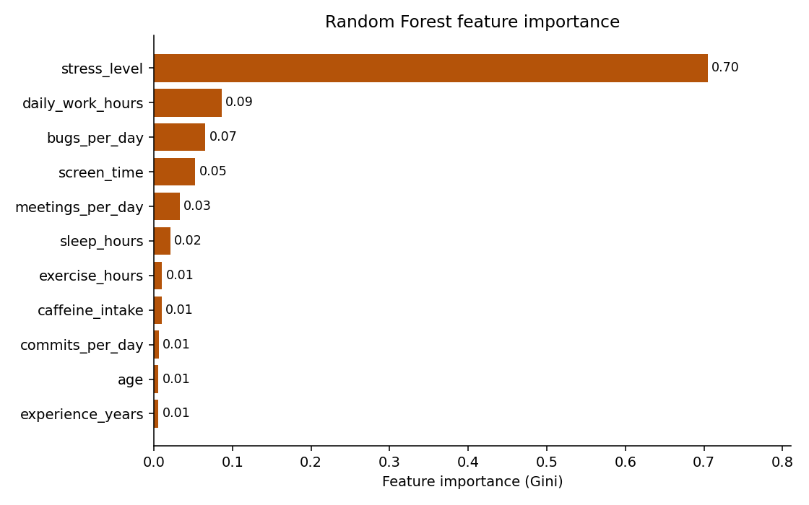

# Developer Burnout Risk Classifier

Random Forest classifier that predicts a developer's burnout risk tier (Low / Medium / High) from work patterns and a self-reported stress score. Deployed as a Streamlit app. Final project for ECON 3916 — Statistical & Machine Learning for Economics.

**[Live demo →](https://econ3916-final-project-bpqngzwfdfzo6ycitevyaw.streamlit.app/)** · [Notebook](3916_final_project_starter.ipynb) · [Open in Colab](https://colab.research.google.com/github/ian-menachery/Burnout-App/blob/main/3916_final_project_starter.ipynb) · [Full writeup (PDF)](3916_final_report.pdf)



## The problem

Most engineering orgs find out about burnout too late — by the time a senior developer gives notice or goes on extended leave, the replacement search and the loss of institutional knowledge are already costs you can't walk back. Industry estimates put replacing a mid-level engineer at 1.5–2× annual salary.

This project asks whether observable work patterns plus a single self-reported stress score can classify a developer into a Low / Medium / High burnout tier accurately enough to support weekly triage by a team lead. The model produces a short-list — which of a team lead's 10–30 reports should get a non-routine workload conversation this cycle. The predicted tier is an input to that conversation, not a substitute for it, and it must not feed into performance reviews, compensation, or any adverse employment decision.

## Headline result

The Random Forest reaches **macro F1 = 0.991 ± 0.002** on 5-fold cross-validation (n = 7,000). On the held-out test set, it correctly flagged **351 of 356 High-tier developers (98.6% recall)**. All five misses were labeled Medium, not Low — every missed High still triggers a scheduled check-in. The asymmetry is the right way around for a triage tool: a false High costs a 15-minute conversation; a false Low costs an attrition event.

The headline F1 needs an asterisk, though. **About 70% of the model's predictive weight comes from a single feature — the self-reported `stress_level` score (1–10).** That feature also correlates 0.49–0.60 with the behavioral features the model is supposedly learning from (daily work hours, screen time, bugs per day). So in practice the classifier is mostly restating self-reported stress rather than predicting independent risk from behavior. A manager who already has the `stress_level` number probably doesn't need this model.



## Approach

- **Data:** [Developer Burnout Prediction Dataset](https://www.kaggle.com/datasets/asifxzaman/developer-burnout-prediction-dataset7000-samples) on Kaggle (n = 7,000, accessed April 2026).
- **Features (11):** age, years of experience, daily work hours, sleep hours, caffeine intake, bugs per day, commits per day, meetings per day, screen time, exercise hours, self-reported stress level.
- **Target:** continuous `Burn Rate` from the dataset, bucketed into Low / Medium / High at roughly the 33rd / 67th percentiles. The cutoffs are an analyst choice, not ground truth.
- **Preprocessing:** dropped rows with missing target labels; median imputation on feature columns (chosen over mean because `bugs_per_day` and `caffeine_intake` are mildly right-skewed); 80/20 stratified train/test split with `random_state=42`.
- **Models:** Multinomial Logistic Regression baseline (`class_weight="balanced"`, `max_iter=2000`) → `RandomForestClassifier` (200 trees, `class_weight="balanced"`).
- **Validation:** 5-fold CV on the training split, macro F1 reported. Baseline LogReg scored **0.945 ± 0.006**; the Random Forest's **0.991 ± 0.002** is a >3σ gap with ~3× lower variance across folds — not a fold-selection fluke.

Full analysis: [`3916_final_project_starter.ipynb`](3916_final_project_starter.ipynb). Full writeup: [`3916_final_report.pdf`](3916_final_report.pdf).

## Threats to validity

| Threat | Evidence | Mitigation |
|---|---|---|
| Stress restatement | `stress_level` carries ~70% of Gini importance and correlates 0.60 with daily work hours | Refit without `stress_level` and compare CV performance directly |
| Likely synthetic source data | Uniform 2% missingness across every column, zero Tukey outliers across 7,000 rows, 99% macro F1 — not what you see in the wild | Validate on internal company data before any production decision |
| Tier cutoff arbitrariness | Low / Medium / High are analyst-set percentile cuts on a continuous `Burn Rate` | Sensitivity-test alternative cutoffs; use the continuous score where stakes allow |
| Point-in-time features | The model sees a single snapshot, but burnout is fundamentally a trajectory | Add rolling 4-week trend features before any pilot expansion |

Feature importance is predictive, not causal. Reducing caffeine intake will not reduce someone's predicted tier in any meaningful sense. And this tool is a screening aid — never a performance review, compensation, or hiring/firing signal.

## Validating the stress-restatement concern

Refitting the Random Forest without `stress_level` (same hyperparameters, same CV folds) drops macro F1 from 0.991 to 0.76 — a 24-point fall, with High-tier recall going from 98.6% to 66.8%. The behavioral features carry real independent signal, but not enough to deploy on their own: the behavior-only model also flips the precision/recall asymmetry the wrong way for a triage tool (precision 0.82 > recall 0.67), meaning it would miss about a third of real burnout cases. The honest read is that `stress_level` is doing most of the work, the behavioral features are doing some, and the tool only has a defensible primary use case where the self-report is reliably collected. A behavior-only fallback is plausible when self-reports are missing or gamed, but with an explicit acceptance of the ~67% recall ceiling.

See section 3.5 of [`3916_final_project_starter.ipynb`](3916_final_project_starter.ipynb) for the full comparison.

## What I'd do next

- **Validate on internal company data** before putting real weight on the model. CV on a Kaggle dataset doesn't tell you real-world generalization.
- **Add longitudinal features** — four-week trends in commit cadence, sleep, and meeting load instead of point-in-time snapshots. Burnout is a trajectory, and a model that can't see trajectories is missing the most useful signal the stakeholder actually cares about.

## Tech stack

Python · scikit-learn · Streamlit · pandas · matplotlib · Jupyter

## Run locally

```
pip install -r requirements.txt
streamlit run app.py
```

`model.pkl` is included in this repo (~6.6 MB). Tested on Python 3.10+. To re-run the analysis end-to-end, open `3916_final_project_starter.ipynb` (locally or in Colab) — runtime ~2 minutes on a laptop, no GPU.

## Repo layout

| File | What it is |
|---|---|
| `app.py` | Streamlit app |
| `model.pkl` | Trained Random Forest |
| `3916_final_project_starter.ipynb` | EDA, preprocessing, modeling, evaluation |
| `developer_burnout_dataset_7000.csv` | Training data (Kaggle source) |
| `3916_final_report.pdf` | Full writeup |
| `requirements.txt` | Python dependencies |
| `feature_importance.png` | Feature importance chart used in this README |
| `screenshot.png` | App screenshot used in this README |

## Course context

Built for ECON 3916 — Statistical & Machine Learning for Economics, Spring 2026, Northeastern University. Code is MIT-licensed; the underlying Kaggle dataset is subject to its original author's terms.
